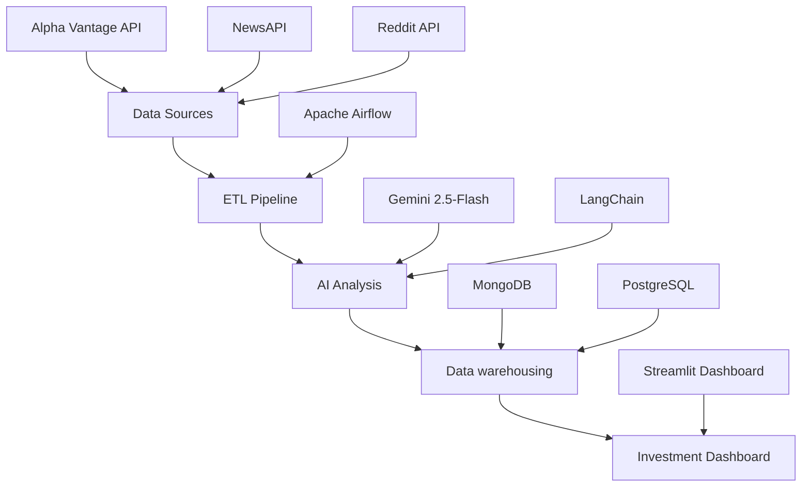

<div align="center">

# ⚡ TESLA | Investment Intelligence Platform


<p><em>Sophisticated ETL-driven investment intelligence platform for comprehensive Tesla Inc. financial and sentiment analysis</em></p>

</div>

---

## 🎯 **Executive Summary**

**TESLA | Investment Intelligence Platform** is a cutting-edge investment intelligence solution built on a robust **ETL pipeline** architecture. Leveraging containerized **Docker** deployment, the platform integrates **Apache Airflow**, **MongoDB**, **PostgreSQL**, and advanced AI capabilities through **Gemini 2.5-Flash**, orchestrated via **LangChain** and visualized through **Streamlit**.

<details>
<summary><strong>🚀 Key Investment Features</strong></summary>

- **Real-time Market Data Integration** from Alpha Vantage
- **Sentiment Analysis** across news and social media
- **AI-Powered Investment Insights** with Gemini 2.0/2.5-Flash
- **Advanced Technical Indicators** and KPI calculations
- **Comprehensive Risk Assessment** tools

</details>

---

## 🔬 **Platform Architecture**

<div align="center">



</div>

### 📊 **Data Extraction Layer**

<table>
<tr>
<td width="33%" align="center">
<br/>
<strong>Market Data</strong><br/>
Historical prices, volumes, technical indicators
</td>
<td width="33%" align="center">
<br/>
<strong>News Intelligence</strong><br/>
Economic headlines, market sentiment
</td>
<td width="33%" align="center">
<br/>
<strong>Social Analysis</strong><br/>
r/Investing community insights
</td>
</tr>
</table>

### 🧠 **AI-Powered Transformation**

**Advanced Analytics Engine**

- **📈 KPI Calculation**: Weekly average closing prices, volatility metrics
- **🎭 Sentiment Analysis**: AI-driven opinion mining from news and social media
- **📝 Executive Summaries**: Automated investment briefings
- **🏷️ Smart Categorization**: Semantic classification of market sentiment

### 💾 **Data Persistence**

| Component | Purpose | Technology |
|-----------|---------|------------|
| **Raw Data Store** | Historical data preservation | MongoDB |
| **Processed Analytics** | Structured investment metrics | PostgreSQL |
| **AI Insights** | Generated summaries and classifications | MongoDB |

---

## 📊 **Understanding Candlestick Charts & Trading Volume**

> **What is a Candlestick Chart?**
> 
> A **candlestick chart** is a sophisticated financial visualization tool that displays price movements over specific time periods. Each "candle" represents a comprehensive view of market activity during that timeframe, providing crucial insights into market and price dynamics.

### **Understanding OHLC Components**

Each candlestick contains four critical price points that define market behavior:

- **Open (O)**: The first trading price when the market opens for the specified period
- **High (H)**: The highest price reached during the trading session
- **Low (L)**: The lowest price touched during the session
- **Close (C)**: The final trading price at the end of the period

**Visual Interpretation:**
- **Green/White Candles**: Close price > Open price (Bullish sentiment)
- **Red/Black Candles**: Close price < Open price (Bearish sentiment)
- **Body**: The thick portion representing the range between Open and Close
- **Wicks/Shadows**: The thin lines extending from the body, showing High and Low extremes

### **Trading Volume Analysis**

**Trading Volume** represents the total number of shares traded during a specific period and serves as a critical confirmation indicator for price movements:

- **High Volume + Price Increase**: Strong bullish momentum, significant buying interest
- **High Volume + Price Decrease**: Strong bearish momentum, significant selling pressure
- **Low Volume + Price Movement**: Weak momentum, potential reversal signals
- **Volume Spikes**: Often indicate important news events, earnings releases, or institutional activity

Volume analysis helps investors distinguish between genuine market trends and temporary price fluctuations, making it an essential component of comprehensive technical analysis.

---

## 🎯 **Recommended Analysis Workflow**

### **Professional Investment Analysis Strategy**

Follow this systematic approach to maximize the platform's analytical capabilities:

**1. 📈 Candlestick & Trend Analysis**
   - Examine the candlestick chart patterns for trend identification
   - Analyze price action, support/resistance levels, and formation patterns
   - Analyse trading volume with price movements

**2. 🔍 Market Trend Assessment**
   - Identify short-term and long-term trend directions
   - Evaluate momentum indicators and volatility patterns

**3. 📰 AI-Powered News Analysis**
   - Review Gemini AI's comprehensive news sentiment analysis
   - Examine automated summaries of market-moving events
   - Analyze sentiment classifications and their potential market impact

**4. 📊 Sentiment Visualization**
   - Study the sentiment analysis charts for trend patterns
   - Analyse how sentiment shifts with price movements
   - Identify divergences between market sentiment and price action

**5. 🗣️ Reddit Community Intelligence**
   - Analyze investor sentiment from r/investing community discussions
   - Review social sentiment trends and community consensus
   - Identify potential contrarian investment opportunities

**6. 🔍 Source Verification & Confirmation**
   - Read detailed news articles and Reddit posts displayed below charts
   - Cross-reference Gemini AI analysis with source materials
   - Validate AI-generated insights against original content for accuracy

This comprehensive workflow ensures a multi-dimensional investment analysis approach, combining technical analysis, AI-powered insights, and community sentiment for informed decision-making.

---

## 🛠 **Technology Stack**

<div align="center">

| **Layer** | **Technology** | **Version/Image** |
|-----------|---------------|-------------------|
| **Orchestration** | Apache Airflow | `apache/airflow:2.8.1-python3.11` |
| **Database (NoSQL)** | MongoDB | `mongo:6-jammy` |
| **Database (SQL)** | PostgreSQL | `postgres:15` |
| **AI Framework** | LangChain | Latest Gemini 2.5 compatible |
| **Frontend** | Streamlit | Latest stable |
| **AI Models** | Google Gemini | `2.0-Flash` & `2.5-Flash` |

</div>

---

## ⚙️ **Deployment Guide**

> **💡 Pro Tip:** Follow these steps precisely for optimal deployment in your local investment analysis environment.

### **Step 1: Repository Setup**
```bash
git clone https://github.com/Basengalenga/Tesla_AI_Investing_Tool.git
cd projectUnit2
```

### **Step 2: Environment Preparation**
```bash
mkdir logs
chmod 777 logs
```

### **Step 3: API Credentials Configuration**

**🔐 Security Configuration**

Navigate to credentials setup:
```bash
cd dags
nano .env
```

Configure your API keys:
```env
GOOGLE_API_KEY="your_gemini_api_key_here"
REDDIT_CLIENT_ID=your_reddit_client_id
REDDIT_CLIENT_SECRET=your_reddit_client_secret
REDDIT_USER_AGENT=your_reddit_user_agent
```

**Obtain credentials from:**
- [Google Gemini AI Studio](https://ai.google.dev/gemini-api/docs) 🤖
- [Reddit API Console](https://www.reddit.com/r/reddit.com/wiki/api/) 🔴

### **Step 4: Platform Initialization**

Return to project root and initialize:
```bash
cd ..
docker-compose run --rm webserver airflow db init
```

### **Step 5: Admin User Creation**
```bash
docker-compose run --rm webserver airflow users create \
    --username airflow \
    --firstname Admin \
    --lastname User \
    --role Admin \
    --email admin@example.com \
    --password airflow
```

### **Step 6: Service Deployment**
```bash
docker-compose up -d
```

### **Step 7: Platform Access**

<div align="center">

**🎛️ AIRFLOW CONTROL CENTER**

Access: [http://localhost:8080](http://localhost:8080)

**Credentials:** `airflow` / `airflow`

</div>

### **Step 8: ETL Pipeline Activation**

Activate the main DAG:
```
EPIC_ULTRA_SUPER_INTELIGENT_TESLA_VIGILANT
```

⏱️ **Wait 2-3 minutes** for complete ETL execution

### **Step 9: Investment Dashboard**

<div align="center">

**📊 INVESTMENT ANALYTICS DASHBOARD**

Access: [http://localhost:8501](http://localhost:8501)

</div>

---

## ⚠️ **Investment Grade Usage Guidelines**

> **🚨 CRITICAL: DO NOT USE VPNS OR PUBLIC PROXIES**
> 
> Please do not use a VPN or public proxy when accessing the Reddit API. Doing so may result in access being restricted or blocked due to Reddit's security and usage policies.

> **🚨 CRITICAL: API Rate Limiting**
> 
> The platform utilizes **Google Gemini AI** with daily usage quotas. **Avoid multiple daily executions** to prevent quota exhaustion and maintain consistent analytical performance. Deploy strategically for maximum investment intelligence value.

---

## 📈 **Investment Intelligence Features**

<div align="center">

### **📊 Market Analytics**
- Candlestick charts with volume analysis
- Technical indicator calculations
- Price volatility assessments

### **🎯 Sentiment Intelligence**
- AI-powered news sentiment analysis
- Social media opinion mining
- Market mood indicators

### **🤖 AI-Generated Insights**
- Executive investment summaries
- Risk assessment reports
- Strategic investment recommendations

</div>

---

<div align="center" style="margin-top: 40px;">

**⚡ TESLA | Investment Intelligence Platform**

*Transforming dispersed market data into actionable investment intelligence*


---

<sub>Built for professional investors | Powered by cutting-edge AI technology</sub>

</div>
